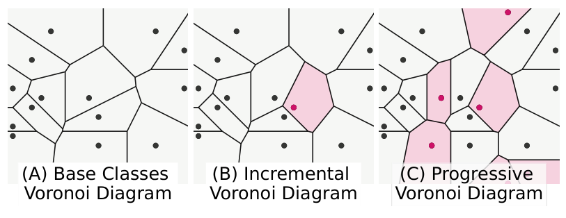
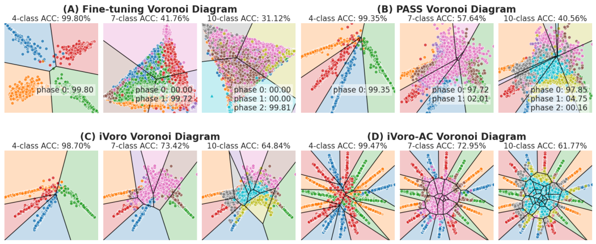

# iVoro
Official code for **Progressive Voronoi Diagram Subdivision Enables Accurate Data-free Class-Incremental Learning**, ICLR'23.

### Introduction
The iVoro method is based on the idea of Voronoi Diagram subdivision from Computational Geometry.
<p align="center">
  
</p>

### Results
The results of MNIST in 2D space below clearly showed different space subdivision results from conventional fine-tuning, PASS, and different variants of iVoro.
<p align="center">
  
</p>

### Reproducing the results

Step 1. Training of the base model, please follow PASS (github).

Step 2. Download the feature files.
Google Drive

Go to the directory:
```bash
cd MNIST
```

### Reference
[ICLR'23](https://openreview.net/forum?id=zJXg_Wmob03)

### Acknowledgments

### Contact
If you have any problem please [contact me](mailto:horsepurve@gmail.com).
